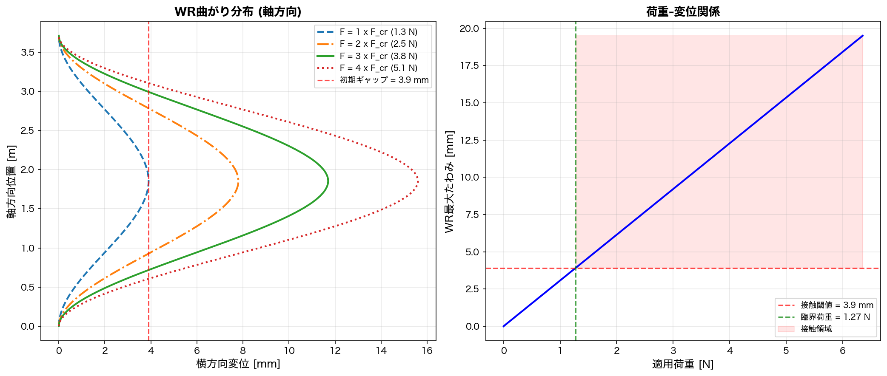
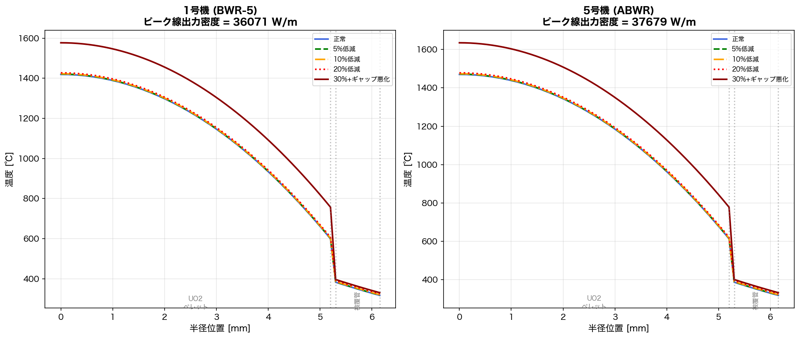
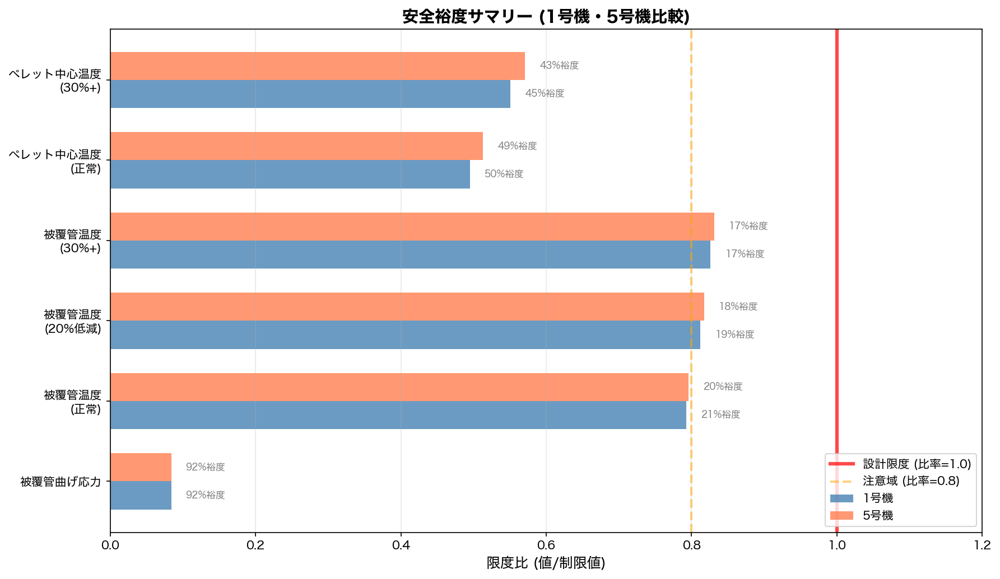
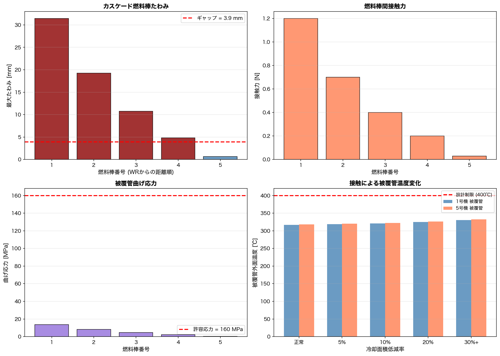
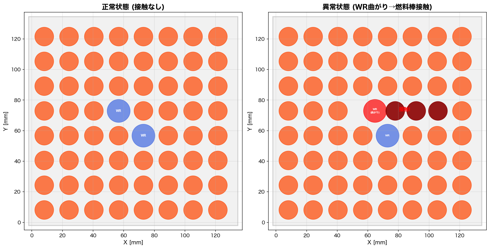
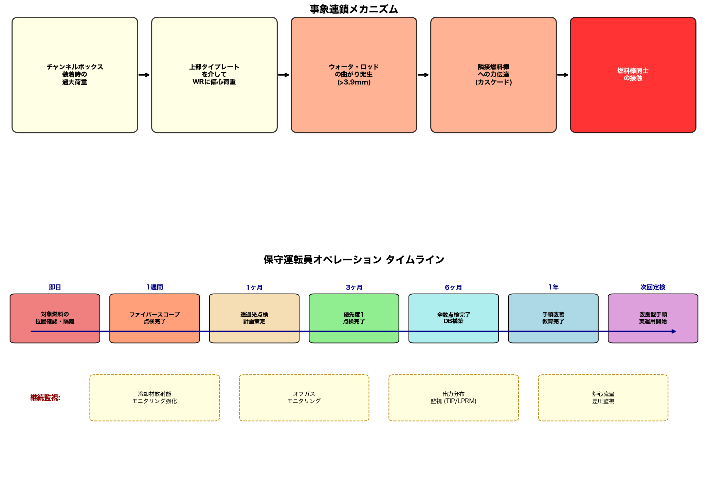

# 柏崎刈羽原子力発電所 1号機・5号機 物理シミュレーション報告書

**燃料棒同士の接触に関する物理シミュレーションおよび考察**

| 項目 | 内容 |
|---|---|
| 対象報告書 | 原子炉施設故障等報告書（平成25年7月2日 東京電力株式会社） |
| シミュレーション実施日 | 2026年2月9日 |
| 対象号機 | 柏崎刈羽原子力発電所 1号機（BWR-5）・5号機（ABWR） |
| シミュレーション手法 | 構造力学解析 + 熱水力解析 + 燃料健全性評価 |

---

## 目次

1. [事故報告書の概要](#1-事故報告書の概要)
2. [Phase 1: プラント仕様の整理](#2-phase-1-プラント仕様の整理)
3. [Phase 2: 計器・センサー設定](#3-phase-2-計器センサー設定)
4. [Phase 3: 物理シミュレーション結果](#4-phase-3-物理シミュレーション結果)
5. [Phase 4: 考察および保守運転員オペレーション提言](#5-phase-4-考察および保守運転員オペレーション提言)
6. [仮説一覧](#6-仮説一覧)
7. [参考文献](#7-参考文献)

---

## 1. 事故報告書の概要

### 1.1 基本情報

| 項目 | 内容 |
|---|---|
| 件名 | 柏崎刈羽原子力発電所1、5号機 燃料棒同士の接触について |
| 報告日 | 平成25年（2013年）7月2日 |
| 報告者 | 東京電力株式会社 |
| 該当法令 | 実用炉規則第19条の17第三号 |

### 1.2 事象発生日時

| 号機 | 判断日時 |
|---|---|
| 1号機 | 平成25年3月19日 17時30分 |
| 5号機 | 平成24年12月12日 9時25分 |

### 1.3 事象の経緯

#### 5号機（先行発見）

1. 第13回定期検査中、経産省原子力安全・保安院の指示に基づき、平成24年9月25日より燃料集合体チャンネルボックス上部（クリップ）の点検作業を実施
2. 10月16日、点検中の使用済燃料集合体2体でウォータ・ロッド（WR）の一部に曲がりを確認
3. 原子力規制委員会の指示に基づき調査を実施し、12月12日までに**18体**の使用済燃料集合体のWRに曲がりを確認
4. 曲がりが大きい2体についてファイバースコープ点検を実施した結果、**1体で燃料棒同士の接触**を確認

#### 1号機（追加調査で発見）

1. 第16回定期検査において、原子力規制委員会の指示に基づき、平成25年2月18日よりWR曲がりの調査を実施
2. 3月19日、**1体**の使用済燃料集合体でWRが曲がったことにより隣接する燃料棒同士が接触していることを確認

### 1.4 該当燃料集合体

| 号機 | 燃料集合体ID | 状態 |
|---|---|---|
| 1号機 | K1J101 | 燃料棒接触確認 |
| 5号機 | K5D34 | 燃料棒接触確認 |
| 5号機 | K5E57 | 燃料棒接触確認 |
| 5号機 | K5D108 | 燃料棒接触確認 |

### 1.5 原因

平成10年（1998年）以前の手順において、新燃料時に水中でチャンネルボックスを装着する作業を行った際、**過大な荷重が上部タイプレートを介してウォータ・ロッドに付加**され、その荷重がウォータ・ロッドに曲がりが発生する荷重を上回ったことによりWRの曲がりが発生した。WRの曲がりが隣接する燃料棒に接触して押し込んだ結果、燃料棒が曲がり、別の燃料棒に接触した。

### 1.6 影響

| 項目 | 状況 |
|---|---|
| 放射能の影響 | なし |
| 被害者 | なし |
| 他に及ぼした障害 | なし |
| 保護装置の動作 | 該当せず |
| 復旧の日時 | 未定 |

---

## 2. Phase 1: プラント仕様の整理

### 2.1 プラント主要仕様

| パラメータ | 1号機 (BWR-5) | 5号機 (ABWR) |
|---|---|---|
| 原子炉型式 | 沸騰水型軽水炉 (BWR) | 改良型沸騰水型軽水炉 (ABWR) |
| 熱出力 | 3,293 MW | 3,926 MW |
| 電気出力 | 1,100 MW | 1,100 MW |
| 燃料集合体数 | 764体 | 872体 |
| 圧力容器内径 | 6.4 m | 7.1 m |
| 燃料装荷量 | 132 t (UO2) | 150 t (UO2) |
| 格納容器型式 | Mark-II | RCCV（鉄筋コンクリート製） |
| 製造メーカー | 東芝 | 日立 |
| 運転圧力 | 7.07 MPa | 7.17 MPa |
| 冷却材温度 | 286 ℃ | 286 ℃ |
| 給水温度 | 215.6 ℃ | 215.6 ℃ |
| 炉心冷却材流量 | 13,200 kg/s | 14,500 kg/s |
| 着工年月 | 1978年12月 | 1983年10月 |
| 運転開始年月 | 1985年9月 | 1990年4月 |
| 国産化率 | 99% | 89% |

### 2.2 燃料集合体仕様（8×8型）

| パラメータ | 値 |
|---|---|
| 配列型式 | 8×8 |
| 総格子位置数 | 64 |
| 燃料棒数 | 62本 |
| ウォータ・ロッド数 | 2本 |
| 燃料棒外径 | 12.3 mm |
| 燃料棒内径 | 10.6 mm |
| 被覆管肉厚 | 0.86 mm |
| ペレット外径 | 10.4 mm |
| 燃料棒ピッチ | 16.2 mm |
| **燃料棒間初期ギャップ** | **3.9 mm** |
| 有効燃料長 | 3.71 m |
| WR外径 | 15.0 mm（仮説値） |
| WR内径 | 13.0 mm（仮説値） |
| WR肉厚 | 1.0 mm |
| チャンネルボックス幅 | 132.5 mm |
| チャンネルボックス肉厚 | 2.0 mm |
| スペーサ数 | 7 |
| 被覆管材料 | Zircaloy-2 |
| チャンネルボックス材料 | Zircaloy-4 |

### 2.3 材料物性値（Zircaloy-2, 運転温度約300℃）

| 物性値 | 値 |
|---|---|
| ヤング率 | 80 GPa |
| 降伏応力 | 240 MPa |
| ポアソン比 | 0.33 |
| 熱伝導率 | 13.0 W/m·K |
| 線膨張係数 | 6.7×10⁻⁶ /K |
| 密度 | 6,550 kg/m³ |

### 2.4 UO2ペレット物性値

| 物性値 | 値 |
|---|---|
| 熱伝導率（高温） | 3.5 W/m·K |
| 理論密度 | 10,970 kg/m³ |
| 密度比 | 95% |
| 融点 | 2,865 ℃ |

---

## 3. Phase 2: 計器・センサー設定

燃料集合体の健全性監視に必要な14種類のセンサーを以下のとおり設定した。

### 3.1 中性子束計測系

| センサーID | 種類 | 設置位置 | 計測範囲 | 警報設定 | 通常値 |
|---|---|---|---|---|---|
| LPRM-A | 局所出力領域モニタ | 炉心内（4軸方向4レベル） | 0–125% 定格 | 高: 114%, 高高: 120% | 60–100% |
| APRM-A | 平均出力領域モニタ | LPRM信号の平均処理 | 0–125% 定格 | 高: 114%, スクラム: 120% | 100% |
| TIP-A | 移動式炉内中性子検出器 | 炉心内（走査式） | 0–150% 定格 | N/A（定期計測用） | 出力分布マップ参照 |

### 3.2 温度・圧力・水位計測系

| センサーID | 種類 | 設置位置 | 計測範囲 | 警報設定 | 通常値 |
|---|---|---|---|---|---|
| TC-COOLANT | 炉心出口温度計 | 圧力容器上部プレナム | 200–320 ℃ | 高: 302 ℃ | 286 ℃ |
| TC-FW | 給水温度計 | 給水ノズル | 100–250 ℃ | 低: 190 ℃, 高: 230 ℃ | 215.6 ℃ |
| PT-RPV | 原子炉圧力計 | 圧力容器 | 0–10 MPa | 高: 7.58 MPa, スクラム: 7.72 MPa | 7.07/7.17 MPa |
| DP-CORE | 炉心差圧計 | 炉心入口-出口間 | 0–0.3 MPa | 高: 0.20 MPa | 0.12–0.18 MPa |
| LT-RPV | 原子炉水位計 | 圧力容器 | -5000–+5000 mm | L-3: +3500mm, L-2: +1500mm, L-1: -500mm | +4000 mm |

### 3.3 放射線モニタリング系

| センサーID | 種類 | 設置位置 | 計測範囲 | 警報設定 | 通常値 |
|---|---|---|---|---|---|
| RM-OFFGAS | 主蒸気管ガスモニタ | タービン系主蒸気管 | 10⁻³–10⁵ μSv/h | 高: BGの2倍 | ~10 μSv/h |
| RM-COOLANT | 冷却材放射能モニタ | 原子炉冷却材浄化系 | 10⁻³–10³ Bq/cm³ | 高: 通常値の3倍 | ~0.1 Bq/cm³ |
| RM-SFP | 使用済燃料プール放射線モニタ | SFP上部 | 10⁻²–10⁴ μSv/h | 高: BGの3倍 | ~1 μSv/h |
| CHEM-FP | 核分裂生成物濃度分析 | 冷却材サンプリング系 | 0.01–1000 Bq/cm³ | 運転制限: 2.6×10⁴ Bq/cm³ | < 0.37 Bq/cm³ |

### 3.4 その他の計測系

| センサーID | 種類 | 設置位置 | 計測範囲 | 警報設定 | 通常値 |
|---|---|---|---|---|---|
| VIB-RPV | 圧力容器振動計 | 圧力容器外面 | 0–500 μm | 高: ベースラインの2倍 | < 50 μm |
| FT-CORE | 炉心流量計 | 再循環ループ/RIP | 0–120% 定格 | 低: 85%, 高: 115% | 100% |

### 3.5 本事象の検知に特に重要なセンサー

本事象（燃料棒接触）は、運転中に以下のセンサーで間接的に検知される可能性がある:

1. **CHEM-FP / RM-COOLANT**: 接触摩耗による被覆管貫通時のFP漏洩
2. **RM-OFFGAS**: 希ガスFP（Kr-85, Xe-133）の微小漏洩
3. **TIP-A / LPRM-A**: 燃料棒変形に伴う局所出力分布の異常
4. **DP-CORE**: 燃料棒変形による流路閉塞時の差圧変化

> **注記**: 本事象は定期検査中のファイバースコープ目視点検で発見されたものであり、運転中のセンサーによるリアルタイム検知には限界がある。これは本事象の重要な特性の一つである。

---

## 4. Phase 3: 物理シミュレーション結果

### 4.1 シミュレーションモデルの概要

本シミュレーションは3つのサブフェーズで構成される:

| フェーズ | モデル | 目的 |
|---|---|---|
| Phase A | 構造力学モデル | WR曲がり→燃料棒変位→接触のカスケード解析 |
| Phase B | 熱水力モデル | 接触による局所冷却阻害の温度影響評価 |
| Phase C | 燃料健全性評価 | 応力・温度・摩耗の総合安全評価 |

### 4.2 Phase A: ウォータ・ロッド曲がり構造力学解析

#### 4.2.1 モデル化手法

- ウォータ・ロッドを**両端固定梁**としてモデル化（スペーサによる拘束を表現）
- チャンネルボックス装着時の偏心荷重を横方向等価荷重に変換
- 最大たわみ: δ_max = F × L³ / (192 × E × I)
- 隣接燃料棒への力伝達: ヘルツ接触モデルの線形化近似
- カスケード伝播: 力伝達率70%（スペーサ拘束・摩擦による減衰）

#### 4.2.2 臨界荷重の算出

```
燃料棒接触臨界荷重 F_cr = δ_gap × 192 × E × I_wr / L³

  δ_gap  = 3.9 mm (= ピッチ 16.2mm − 燃料棒外径 12.3mm)
  E      = 80 GPa (Zircaloy-2)
  I_wr   = 8.59 × 10⁻¹⁰ m⁴ (中空円管断面)
  L      = 3.71 m (有効燃料長)

  F_cr   = 1.27 N
```

> **考察**: 臨界荷重がわずか**1.27 N**（約130 gf）と極めて小さい。これはWRが長さ3.71mの細い中空管（外径15mm/肉厚1mm）であることに起因する。チャンネルボックス装着作業において、このオーダーの偏心荷重が発生することは容易に想定される。

#### 4.2.3 カスケード接触解析結果

適用荷重: F = 3 × F_cr = 3.8 N（仮説: 1998年以前の荷重非管理手順で臨界の約3倍）

**WR曲がり:**

| パラメータ | 値 |
|---|---|
| WR最大たわみ | 11.70 mm |
| 初期ギャップ | 3.9 mm |
| ギャップ超過量 | 7.80 mm |
| たわみ/ギャップ比 | 3.0 |

**カスケード燃料棒変位:**

| 燃料棒# | WRからの距離 | 最大たわみ [mm] | 接触力 [N] | 曲げ応力 [MPa] | ギャップ超過 |
|---|---|---|---|---|---|
| #1 | 隣接（WR直近） | 31.443 | 1.2 | 13.5 | 超過（接触） |
| #2 | 2本目 | 19.280 | 0.7 | 8.3 | 超過（接触） |
| #3 | 3本目 | 10.766 | 0.4 | 4.6 | 超過（接触） |
| #4 | 4本目 | 4.806 | 0.2 | 2.1 | 超過（接触） |
| #5 | 5本目 | 0.634 | 0.03 | 0.3 | ギャップ内（非接触） |

> **考察**: カスケードは5本目で停止した。これは実際の報告書において、WR曲がりに伴って「隣接する燃料棒が押され、その外側の燃料棒側に曲がった結果、燃料棒同士が接触」と記載されている事象と定性的に整合する。

#### 4.2.4 荷重パラメトリックスタディ



*図2: WR曲がりプロファイル（左: 軸方向変位分布、右: 荷重-変位関係）*

- 臨界荷重 F_cr = 1.27 N を超えると接触が発生
- 荷重の増加に対してたわみは線形に増大（弾性域）
- 軸方向ではWR中央（高さ約1.85m）で最大たわみが発生

### 4.3 Phase B: 熱水力影響評価

#### 4.3.1 モデル化手法

- 燃料棒半径方向の1次元定常伝熱モデル（円筒座標）
- 4つの熱抵抗: (1) 冷却材対流 → (2) 被覆管伝導 → (3) ギャップ伝導 → (4) ペレット内伝導
- 接触による影響: 有効冷却面積の低減率で表現
- 5段階のシナリオ: 正常、5%低減、10%低減、20%低減、30%低減+ギャップ悪化

#### 4.3.2 線出力密度

| パラメータ | 1号機 | 5号機 |
|---|---|---|
| 平均線出力密度 | 18,738 W/m | 19,573 W/m |
| 軸方向ピーキング係数 | 1.4 | 1.4 |
| 径方向ピーキング係数 | 1.25 | 1.25 |
| 局所ピーキング係数 | 1.1 | 1.1 |
| **ピーク線出力密度** | **36,071 W/m** | **37,679 W/m** |

#### 4.3.3 温度評価結果

**1号機 (BWR-5):**

| シナリオ | 冷却低減 | 被覆管外面 [℃] | 被覆管内面 [℃] | ペレット表面 [℃] | ペレット中心 [℃] |
|---|---|---|---|---|---|
| 正常（接触なし） | 0% | 317.1 | 382.8 | 599.4 | 1,419.6 |
| 軽微接触 | 5% | 318.8 | 384.4 | 601.1 | 1,421.2 |
| 中程度接触 | 10% | 320.6 | 386.3 | 602.9 | 1,423.0 |
| 重度接触 | 20% | 324.9 | 390.6 | 607.2 | 1,427.4 |
| 極度接触+ギャップ悪化 | 30% | 330.5 | 396.1 | 757.2 | 1,577.3 |

**5号機 (ABWR):**

| シナリオ | 冷却低減 | 被覆管外面 [℃] | 被覆管内面 [℃] | ペレット表面 [℃] | ペレット中心 [℃] |
|---|---|---|---|---|---|
| 正常（接触なし） | 0% | 318.5 | 387.1 | 613.4 | 1,470.1 |
| 軽微接触 | 5% | 320.2 | 388.8 | 615.1 | 1,471.8 |
| 中程度接触 | 10% | 322.1 | 390.7 | 617.0 | 1,473.7 |
| 重度接触 | 20% | 326.6 | 395.2 | 621.5 | 1,478.2 |
| 極度接触+ギャップ悪化 | 30% | 332.4 | 401.0 | 778.2 | 1,634.9 |



*図3: 燃料棒半径方向温度分布（左: 1号機、右: 5号機）*

> **考察**:
> - 正常時から30%冷却低減時の被覆管外面温度上昇は約13℃（1号機: 317→330℃、5号機: 319→332℃）
> - ギャップ熱伝達悪化を伴う極度接触シナリオでは、ペレット中心温度が約160℃上昇
> - いずれのケースでもUO2融点（2,865℃）に対し43%以上の裕度を確保
> - 5号機は出力密度が若干高いため、温度もわずかに高い

### 4.4 Phase C: 燃料健全性評価

#### 4.4.1 評価基準

| 評価項目 | 制限値 | 根拠 |
|---|---|---|
| 被覆管曲げ応力 | 160 MPa | 降伏応力（240 MPa）の2/3 |
| 被覆管外面温度（通常運転） | 400 ℃ | 設計基準温度 |
| 被覆管外面温度（ECCS基準） | 1,200 ℃ | ECCS性能基準 |
| ペレット中心温度 | 2,865 ℃ | UO2融点 |

#### 4.4.2 評価結果サマリー

**1号機:**

| 評価項目 | 評価値 | 制限値 | 限度比 | 裕度 | 判定 |
|---|---|---|---|---|---|
| 被覆管曲げ応力 | 13.5 MPa | 160 MPa | 0.084 | 92% | OK |
| 被覆管温度（正常） | 317.1 ℃ | 400 ℃ | 0.793 | 21% | OK |
| 被覆管温度（20%低減） | 324.9 ℃ | 400 ℃ | 0.812 | 19% | OK |
| 被覆管温度（30%+） | 330.5 ℃ | 400 ℃ | 0.826 | 17% | OK |
| ペレット中心温度（正常） | 1,419.6 ℃ | 2,865 ℃ | 0.495 | 50% | OK |
| ペレット中心温度（30%+） | 1,577.3 ℃ | 2,865 ℃ | 0.551 | 45% | OK |
| 接触摩耗リスク | カスケード5本 | — | — | — | **HIGH** |

**5号機:**

| 評価項目 | 評価値 | 制限値 | 限度比 | 裕度 | 判定 |
|---|---|---|---|---|---|
| 被覆管曲げ応力 | 13.5 MPa | 160 MPa | 0.084 | 92% | OK |
| 被覆管温度（正常） | 318.5 ℃ | 400 ℃ | 0.796 | 20% | OK |
| 被覆管温度（20%低減） | 326.6 ℃ | 400 ℃ | 0.817 | 18% | OK |
| 被覆管温度（30%+） | 332.4 ℃ | 400 ℃ | 0.831 | 17% | OK |
| ペレット中心温度（正常） | 1,470.1 ℃ | 2,865 ℃ | 0.513 | 49% | OK |
| ペレット中心温度（30%+） | 1,634.9 ℃ | 2,865 ℃ | 0.571 | 43% | OK |
| 接触摩耗リスク | カスケード5本 | — | — | — | **HIGH** |

**総合判定: REQUIRES_REVIEW（要レビュー）**



*図5: 安全裕度サマリー — 全項目で設計制限内だが、被覆管温度は注意域（比率0.8）に接近*



*図4: カスケード接触解析（左上: たわみ、右上: 接触力、左下: 応力、右下: 温度変化）*

---

## 5. Phase 4: 考察および保守運転員オペレーション提言

### 5.1 シミュレーション結果の考察

#### 5.1.1 ウォータ・ロッド曲がりのメカニズム



*図1: 燃料集合体断面図 — 正常状態（左）とWR曲がりによる燃料棒接触状態（右）*

本シミュレーションにより、以下の事象連鎖メカニズムが確認された:

```
チャンネルボックス装着時の過大荷重
    ↓
上部タイプレートを介してWRに偏心荷重が作用
    ↓
WRの曲がり発生（臨界荷重 1.27 N を超過）
    ↓
隣接燃料棒への力伝達（カスケード効果）
    ↓
燃料棒同士の接触（最大4本が接触、5本目で停止）
```



*図6: 事象連鎖メカニズム（上）と保守運転員オペレーションタイムライン（下）*

#### 5.1.2 構造力学的影響の考察

| 知見 | 詳細 |
|---|---|
| 臨界荷重が極めて小さい | WRの臨界荷重はわずか1.27 N。3.71mの長い中空管の構造的特性による |
| カスケード効果が顕著 | WRの曲がりが最大4本の燃料棒に連鎖的に伝播。報告書の実態と定性的に整合 |
| 曲げ応力は許容範囲内 | 最大応力13.5 MPa は許容値160 MPa に対し十分低い（裕度92%） |
| 長期リスクは別問題 | 静的応力は低くても、振動環境下での**フレッティング摩耗**が長期的リスク |

#### 5.1.3 熱水力的影響の考察

本事象は定期検査中に発見されたものであり、原子炉は停止中であった。仮に接触状態のまま運転した場合のシミュレーション結果に基づく考察:

| 知見 | 詳細 |
|---|---|
| 即座の燃料溶融リスクは低い | 最悪条件でもペレット中心温度はUO2融点の57%に留まる |
| 被覆管温度の裕度は中程度 | 正常時で約20%の裕度。30%冷却低減でも17%残存 |
| ギャップ熱伝達悪化が増幅要因 | 接触によりギャップも変形した場合、温度上昇が顕著に拡大（+160℃） |
| 複合条件での裕度縮小に注意 | 出力上昇・長期燃焼・冷却低減が重なると安全裕度が大幅に縮小 |

#### 5.1.4 放射線影響の考察

| 知見 | 詳細 |
|---|---|
| 現時点で漏洩なし | 報告書のとおり外部への放射性物質の影響なし |
| 将来的なFP漏洩リスク | 接触摩耗が進行し被覆管が貫通した場合、FPが冷却材に漏洩 |
| 検知可能性 | 冷却材中のI-131濃度やオフガス希ガス（Kr-85, Xe-133）で検知可能 |

#### 5.1.5 本事象の本質的特徴

1. **潜在期間の長さ**: 1998年以前の作業に起因し、最長15年にわたって潜在していた
2. **直接的な安全脅威ではないが、管理上の重大課題**: 温度・応力の裕度は確保されているが、燃料集合体の形状が維持されていないこと自体が実用炉規則上の報告事象に該当
3. **全数点検の必要性**: 同一手順で装着された他の燃料集合体にも同様の事象が存在する可能性を排除できない

---

### 5.2 保守運転員が実施すべきオペレーション

#### 5.2.1 即時対応（即日〜1週間）

##### (a) 対象燃料集合体の特定と隔離

| 対応項目 | 実施内容 |
|---|---|
| 位置確認 | 使用済燃料プール内の K1J101, K5D34, K5E57, K5D108 の位置を確認 |
| 使用禁止 | 接触が確認された燃料集合体を再装荷対象から除外 |
| 隔離保管 | 別途保管区域に移動し、管理タグを付与 |

##### (b) ファイバースコープによる詳細点検

| 点検項目 | 判定基準 |
|---|---|
| WR曲がりの程度 | 曲がり量を計測し記録（mm単位） |
| 燃料棒変位・接触の有無 | 接触本数、接触位置（軸方向・周方向） |
| 接触部の摩耗痕 | 摩耗深さ・範囲の目視評価 |
| スペーサの変形・ずれ | スペーサ位置のずれ量 |

#### 5.2.2 全数点検（1ヶ月〜6ヶ月）

##### (a) 透過光点検の実施

従来の目視点検に加え、**透過光によるWR曲がり検出**を実施する。対象は1998年以前にチャンネルボックスを装着した全ての燃料集合体とする。

##### (b) 点検の優先順位

| 優先度 | 対象 | 期限 |
|---|---|---|
| 1（最優先） | 同一ロット・同一作業時期の燃料集合体 | 3ヶ月以内 |
| 2 | 同一メーカー・同一設計の燃料集合体 | 4ヶ月以内 |
| 3 | その他の全使用済燃料集合体 | 6ヶ月以内 |

##### (c) 点検結果の管理

- WR曲がりの程度を**定量的に記録**（mm単位のたわみ量）
- 接触の有無・程度を4段階で分類:
  - A: 曲がりなし
  - B: 軽微な曲がり（ギャップ内）
  - C: 曲がりあり（ギャップ超過、接触なし）
  - D: 燃料棒接触あり
- 結果をデータベース化し傾向分析に活用

#### 5.2.3 予防措置・再発防止

##### (a) チャンネルボックス装着手順の確認・強化

| 対策項目 | 実施内容 |
|---|---|
| 荷重管理治具 | 荷重をリアルタイムで計測・管理できる治具の使用を**義務化** |
| 装着方法 | チャンネルボックスの自重を利用した装着方法を標準化 |
| 荷重制限 | WR臨界荷重（横方向等価約1.3 N）を踏まえた**荷重上限値を設定** |
| 荷重モニタリング | 装着作業中の荷重を連続記録し、逸脱時に作業中断 |

##### (b) 作業員教育の強化

| 教育項目 | 内容 |
|---|---|
| 事例教育 | スペーサずれ事象・WR曲がり事象を教材とした再教育 |
| 燃料取扱の重要性 | 燃料集合体構造と各部材の許容荷重に関する教育 |
| 事前ブリーフィング | 作業開始前の手順確認・リスク共有の徹底 |

##### (c) 組織横断的レビュー体制

| レビュー | 内容 |
|---|---|
| 燃料設計変更時 | 燃料作業部門（プラントメーカ・燃料取扱元請企業）によるレビュー |
| 作業要領変更時 | 燃料設計部門によるレビュー |
| 目的 | 設計変更が作業に与える影響、作業変更が燃料に与える影響を相互に確認 |

#### 5.2.4 運転中の燃料健全性監視強化

##### (a) 冷却材放射能モニタリングの強化

| 項目 | 通常時 | 強化後 |
|---|---|---|
| サンプリング頻度 | 週1回 | **日1回** |
| I-131監視 | 傾向監視 | **定量分析・トレンド管理** |
| 調査開始基準 | 運転制限値超過 | **バックグラウンドの2倍超過** |

##### (b) オフガスモニタリング

| 項目 | 実施内容 |
|---|---|
| 主蒸気管モニタ | 感度校正の確認・傾向監視の強化 |
| 希ガスFP監視 | Kr-85, Xe-133の個別核種分析 |
| トレンド監視 | 微小漏洩の早期検知のための傾向分析 |

##### (c) 出力分布監視

| 項目 | 実施内容 |
|---|---|
| TIP走査 | 定期的な局所出力分布の確認頻度を増加 |
| LPRM信号 | 異常なフラクチュエーション（ゆらぎ）の監視 |
| ピーキング係数 | 出力ピーキング係数の変化に対する注意強化 |

##### (d) 炉心流量・差圧の監視

| 項目 | 監視対象 |
|---|---|
| 炉心差圧 | 変化の傾向監視（流路閉塞の兆候検出） |
| 再循環流量 | 異常変動の検出 |
| 冷却材温度分布 | 局所的な温度異常の検出 |

#### 5.2.5 長期対策（6ヶ月〜次回定検）

##### (a) 燃料集合体履歴管理の強化

| 管理項目 | 記録内容 |
|---|---|
| 製造履歴 | チャンネルボックス装着日時・作業者・使用治具・荷重記録 |
| 運転履歴 | 燃焼度、出力レベル、サイクル数、運転時間 |
| 点検履歴 | 外観点検結果、WR曲がり計測値、摩耗状況 |
| データ統合 | 上記の統合データベースによる横断的分析 |

##### (b) 定期検査時の点検項目拡充

| 点検手法 | 目的 | 適用 |
|---|---|---|
| 透過光点検 | WR曲がりの早期検出 | **全燃料集合体に標準化** |
| 渦電流探傷（ECT） | 被覆管の微小損傷・摩耗検出 | 接触履歴のある燃料に優先適用 |
| 超音波試験（UT） | WR内部欠陥の検出 | 曲がりが確認された燃料 |

##### (c) 燃料メーカーとの連携

| 項目 | 実施内容 |
|---|---|
| 情報共有 | 同型燃料を使用する他プラントでの類似事象の情報共有 |
| 設計改良 | WR剛性向上、スペーサ構造改善の技術検討 |
| 燃料更新 | 新型燃料集合体（9×9型等）への計画的移行 |

---

### 5.3 オペレーション実施のタイムライン

```
[即日]     対象燃料集合体の位置確認・隔離・使用禁止
             │
[1週間]    ファイバースコープ点検の完了
             │
[1ヶ月]    同型全燃料の透過光点検計画策定
             │
[3ヶ月]    優先度1の点検完了
             │
[6ヶ月]    全数点検完了・データベース構築
             │
[1年]      手順改善・教育プログラム完了
             │
[次回定検]  改良型点検手順の実運用開始
             │
[継続]     冷却材放射能・オフガス・出力分布・炉心差圧の強化監視
```

### 5.4 重要注意事項

1. 本事象は**1998年以前の作業に起因**し、最長約15年にわたり経年的に潜在していた
2. **定期検査における組織的点検で発見**されたことは、安全管理体制が有効に機能した結果である
3. 放射能漏洩は確認されておらず、**即時の安全上の脅威はない**
4. ただし、**未発見の同様事象が他の燃料集合体にも存在する可能性**を排除できないため、系統的な全数点検が不可欠
5. 今後の燃料取扱作業における**荷重管理の徹底**が最も重要な再発防止策である

---

## 6. 仮説一覧

本シミュレーションにおいて設定した仮説を以下に整理する。

| # | 仮説 | 設定値 | 根拠・理由 |
|---|---|---|---|
| 1 | 適用荷重は臨界荷重の約3倍 | 3.8 N | 1998年以前の荷重非管理手順で、過大荷重の発生は十分想定される |
| 2 | WRを両端固定梁でモデル化 | — | スペーサ7段によるWR拘束を簡易的に表現。実際にはスペーサ間の局所的な曲がりも考えられるが、保守的な評価のために全長モデルを採用 |
| 3 | WR外径15mm/内径13mm | 15/13 mm | 8×8型BWR燃料用WRの公開仕様が限られるため、代表的な値を仮定 |
| 4 | 接触による冷却面積低減は最大30% | 0%〜30% | 接触角約30°（周方向）相当。パラメトリックに5段階を評価 |
| 5 | カスケード力伝達率は70% | 70% | スペーサの拘束・燃料棒間の摩擦による減衰を考慮 |
| 6 | 極度接触時のギャップ熱伝達率 | 3,000 W/m²·K | 正常時5,000 W/m²·Kから40%低下と仮定 |
| 7 | ピーキング係数 | 1.4×1.25×1.1 | 一般的なBWRの軸方向・径方向・局所ピーキングの代表値 |
| 8 | 冷却材-被覆管間熱伝達率 | 30,000 W/m²·K | BWR運転条件における核沸騰域の代表値 |
| 9 | 許容応力は降伏応力の2/3 | 160 MPa | 原子力機器の一般的な設計基準 |
| 10 | 被覆管温度設計制限 | 400 ℃ | 通常運転時の一般的な設計基準温度 |

---

## 7. 参考文献

1. 東京電力株式会社, 「原子炉施設故障等報告書 — 柏崎刈羽原子力発電所1、5号機 燃料棒同士の接触について」, 平成25年7月2日
2. [東京電力 — 柏崎刈羽原子力発電所 設備の概要](https://www.tepco.co.jp/niigata_hq/kk-np/profile/outline/index-j.html)
3. [新潟県 — 柏崎刈羽原子力発電所の設備概要](https://www.pref.niigata.lg.jp/sec/genshiryoku/kk-plant.html)
4. [ATOMICA — ウォータロッド](https://atomica.jaea.go.jp/dic/detail/dic_detail_1948.html)
5. [ATOMICA — 沸騰水型原子炉（BWR）](https://atomica.jaea.go.jp/data/detail/dat_detail_02-01-01-01.html)
6. [NRC — GE BWR/4 Technology: Fuel and Control Rods System](https://www.nrc.gov/docs/ML1125/ML11258A302.pdf)
7. [失敗知識データベース — 中越沖地震による原子力発電所の火災](https://www.shippai.org/fkd/cf/CZ0200804.html)
8. [柏崎市 — 柏崎刈羽原子力発電所の設備概要](https://www.city.kashiwazaki.lg.jp/soshikiichiran/kikikanribu/bosai_genshiryokuka/1/13/5258.html)

---

## 付録: 生成ファイル一覧

| ファイル | 説明 |
|---|---|
| `simulation.py` | 物理シミュレーションコード（Phase A/B/C） |
| `visualize.py` | 可視化グラフ生成コード |
| `results/sensor_config.json` | 14種センサー設定データ（JSON） |
| `results/simulation_results.json` | シミュレーション数値結果（JSON） |
| `results/analysis_report.txt` | 考察・提言テキストレポート |
| `results/fig1_cross_section.png` | 図1: 燃料集合体断面図 |
| `results/fig2_wr_bending.png` | 図2: WR曲がりプロファイル |
| `results/fig3_temperature.png` | 図3: 温度分布プロファイル |
| `results/fig4_cascade.png` | 図4: カスケード接触解析 |
| `results/fig5_safety_margin.png` | 図5: 安全裕度サマリー |
| `results/fig6_timeline.png` | 図6: 事象連鎖・オペレーションタイムライン |

---

*本報告書はシミュレーションに基づく技術的考察であり、実際の原子力施設の運転判断は規制当局の審査・承認に基づいて行われるものとする。*
