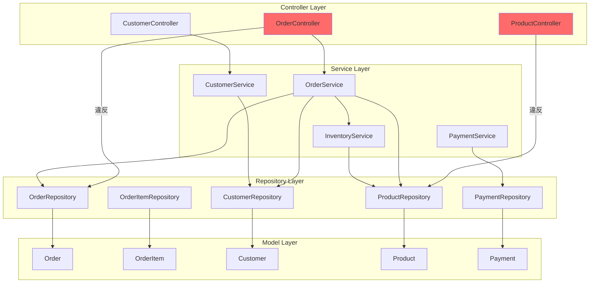
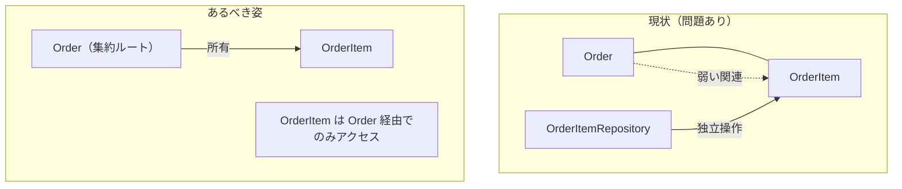
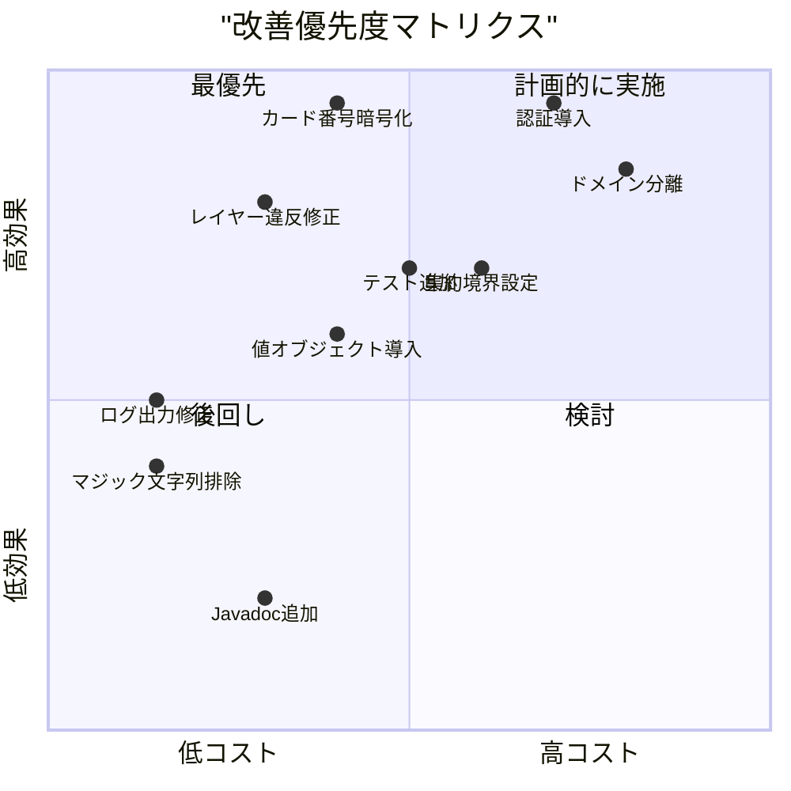

# 詳細評価レポート - Legacy E-Commerce System

## 1. システム概要

### プロジェクト構成

| 項目 | 値 |
|------|-----|
| 言語 | Java 17 |
| フレームワーク | Spring Boot 3.x |
| ORM | Spring Data JPA |
| DB | MySQL |
| ビルドツール | Maven |

### ソースコード統計

| カテゴリ | ファイル数 | 主なファイル |
|----------|-----------|-------------|
| Controller | 3 | OrderController, CustomerController, ProductController |
| Service | 4 | OrderService, InventoryService, CustomerService, PaymentService |
| Model | 5 | Order, OrderItem, Customer, Product, Payment |
| Repository | 5 | OrderRepository, CustomerRepository, ProductRepository, OrderItemRepository, PaymentRepository |
| Utility | 2 | DateUtil, ValidationUtil |
| Application | 1 | EcommerceApplication |
| **合計（本体）** | **20** | |
| Test | 1 | OrderServiceTest |
| **総合計** | **21** | |

### ドメイン

| ドメイン | 関連クラス |
|----------|-----------|
| 注文管理 | Order, OrderItem, OrderService, OrderController, OrderRepository, OrderItemRepository |
| 在庫管理 | InventoryService (Product共有) |
| 顧客管理 | Customer, CustomerService, CustomerController, CustomerRepository |
| 決済処理 | Payment, PaymentService, PaymentRepository |
| 商品管理 | Product, ProductController, ProductRepository |

---

## 2. アーキテクチャ分析

### 2.1 パッケージ構造

```
com.example.ecommerce/
├── controller/     # Web層 - REST API
├── service/        # サービス層 - ビジネスロジック
├── model/          # モデル層 - JPAエンティティ
├── repository/     # データアクセス層
└── util/           # ユーティリティ
```

**問題点:** 技術的レイヤリングのみ。ドメイン別の分離がない。

### 2.2 依存関係マップ



### 2.3 レイヤー違反の詳細

#### OrderController → OrderRepository（直接アクセス）

```java
// OrderController.java (lines 29-30)
@Autowired
private OrderRepository orderRepository; // サービス層をバイパス

// 直接リポジトリを使用する例
@GetMapping
public ResponseEntity<List<Order>> getAllOrders() {
    return ResponseEntity.ok(orderRepository.findAll()); // サービス不使用
}
```

#### ProductController → ProductRepository（サービス層なし）

```java
// ProductController.java - サービス層が存在しない
@Autowired
private ProductRepository productRepository;

// 全CRUDがコントローラ内で直接実行
```

---

## 3. ドメインモデル分析

### 3.1 エンティティ評価

| エンティティ | 行数 | ビジネスロジック | 問題 |
|-------------|------|----------------|------|
| `Order` | 62 | なし（setter/getter のみ） | Anemic、Status が String、顧客データ重複 |
| `OrderItem` | 46 | `@PrePersist` で小計計算 | 集約外で独立操作可能、弱い不変条件 |
| `Customer` | 43 | なし | Address が単純 String、Email バリデーションなし |
| `Product` | 45 | なし | 在庫を直接公開、Money VO なし |
| `Payment` | 46 | なし | カード番号平文保存、Status が String |

### 3.2 不在の値オブジェクト

| 値オブジェクト | 必要性 | 現状 |
|---------------|--------|------|
| `OrderId` | 高 | Long 使用 |
| `Money` | 高 | BigDecimal 直接使用 |
| `OrderStatus` | 高 | String マジック文字列 |
| `PaymentStatus` | 高 | String マジック文字列 |
| `Email` | 中 | String、バリデーションなし |
| `Address` | 中 | String 1フィールド |
| `PhoneNumber` | 低 | Customer 内に `phone` として String |

### 3.3 集約境界の問題



- `OrderItem` が独自の `OrderItemRepository` を持ち、集約ルート（Order）を経由せず直接操作可能
- `Order` のイテム追加/削除に不変条件が設定されていない

---

## 4. セキュリティ評価

### 4.1 認証・認可

| 項目 | 状態 | リスク |
|------|------|--------|
| 認証機構 | なし | Critical |
| 認可チェック | なし | Critical |
| Spring Security | 未導入 | Critical |
| CSRF対策 | なし | High |
| CORS設定 | 不明 | Medium |

### 4.2 データ保護

| 項目 | 状態 | リスク |
|------|------|--------|
| カード番号保存 | **平文で保存** | **Critical** |
| カード番号ログ | **コンソールに出力** | **Critical** |
| 個人情報保護 | 全データが無制限に返却 | High |
| 入力バリデーション | なし | Critical |

**PaymentService の問題コード:**
```java
// PaymentService.java - カード番号を平文で保存・ログ出力
System.out.println("Processing payment with card: " + cardNumber); // カード番号ログ出力
payment.setCardNumber(cardNumber); // 平文保存
```

### 4.3 PCI DSS 非準拠項目

- カード番号の暗号化なし
- カード番号のログ出力
- アクセス制御なし
- 監査ログなし

---

## 5. サービス間依存分析

### 5.1 OrderService の依存関係

| 依存先 | 種類 | 用途 |
|--------|------|------|
| `OrderRepository` | 直接注入 | 注文の永続化 |
| `CustomerRepository` | 直接注入 | 顧客の検索 |
| `ProductRepository` | 直接注入 | 商品の検索 |
| `InventoryService` | 直接注入 | 在庫の確認・予約 |

**問題:** OrderService が4つの依存を持ち、3つの異なるドメイン（注文、顧客、商品/在庫）にまたがる操作を実行

### 5.2 トランザクション境界

| サービス | トランザクション管理 | 問題 |
|----------|---------------------|------|
| `OrderService.createOrder()` | `@Transactional` | 注文作成、在庫更新、金額計算が単一トランザクション |
| `PaymentService.processPayment()` | `@Transactional` | 決済処理が注文とは別トランザクション（不整合リスク） |
| `InventoryService.reserveStock()` | なし | **トランザクション管理なし（race condition）** |

---

## 6. 改善優先度マトリクス



---

## 7. 推奨改善ロードマップ

### Phase 1: 緊急対応（1-2週間）

| # | 施策 | 対象課題 | 期待効果 |
|---|------|---------|---------|
| 1 | カード番号の暗号化/トークン化 | C-1 | セキュリティリスク排除 |
| 2 | ログからカード番号を除去 | C-2 | PCI DSS準拠の第一歩 |
| 3 | Spring Security 導入 | C-3 | 認証・認可の基盤構築 |
| 4 | 入力バリデーション（Bean Validation）導入 | C-4 | インジェクション攻撃防止 |

### Phase 2: 短期改善（1-2ヶ月）

| # | 施策 | 対象課題 | 期待効果 |
|---|------|---------|---------|
| 5 | レイヤー違反の修正 | C-5 | アーキテクチャ整合性回復 |
| 6 | 循環依存の解消 | C-6 | サービス間の疎結合化 |
| 7 | テストカバレッジ向上（40%目標） | C-8 | リグレッション防止 |
| 8 | マジックストリング→列挙型 | M-6 | 型安全性向上 |

### Phase 3: 中期改善（2-4ヶ月）

| # | 施策 | 対象課題 | 期待効果 |
|---|------|---------|---------|
| 9 | 値オブジェクト導入 | M-3 | ドメインモデルの表現力向上 |
| 10 | 集約境界の設定 | M-4, M-5 | データ整合性の保証 |
| 11 | ドメインモデルへのロジック移動 | M-2 | 凝集度向上、テスタビリティ改善 |
| 12 | OpenAPI仕様書の作成 | M-9 | API契約の明確化 |

### Phase 4: 長期改善（4-6ヶ月）

| # | 施策 | 対象課題 | 期待効果 |
|---|------|---------|---------|
| 13 | ドメイン別パッケージ分離 | 凝集度 | マイクロサービス分割の基盤 |
| 14 | イベント駆動アーキテクチャ導入 | 結合度 | サービス間の非同期通信 |
| 15 | テストカバレッジ80%到達 | テスト品質 | 安全なリファクタリングの基盤 |
| 16 | マイクロサービス分割の検討 | 総合 | スケーラビリティ向上 |

### 改善後の目標スコア

| 軸 | 現在 | Phase 2 後 | Phase 4 後 |
|----|------|-----------|-----------|
| 設計整合性 | 53 | 70 | 85 |
| テストカバレッジ | 35 | 55 | 80 |
| ドキュメント | 25 | 45 | 70 |
| コード品質 | 62 | 75 | 85 |
| **総合MMI** | **45 (D)** | **63 (C)** | **81 (A)** |
