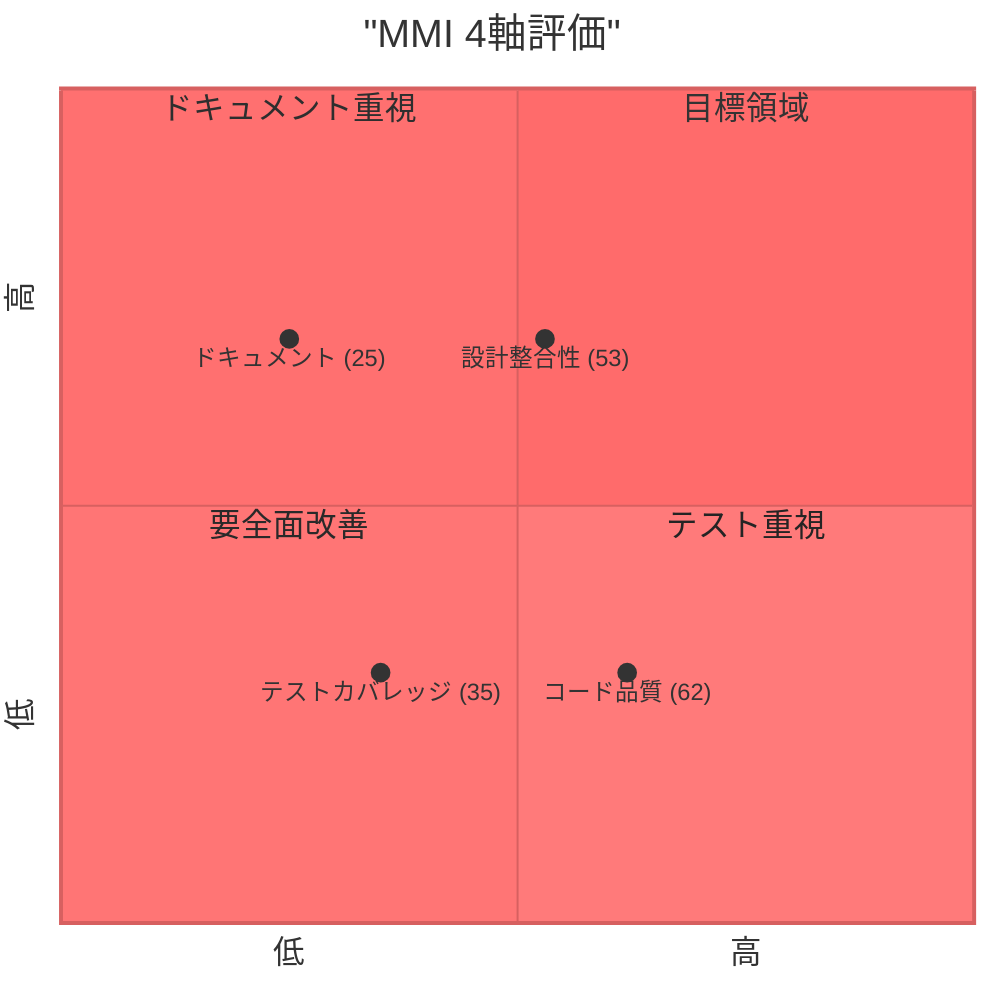
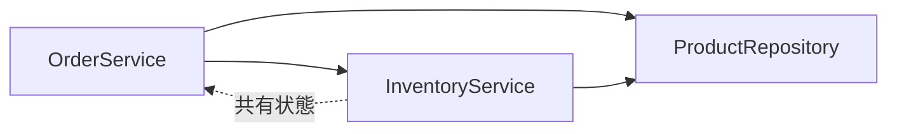
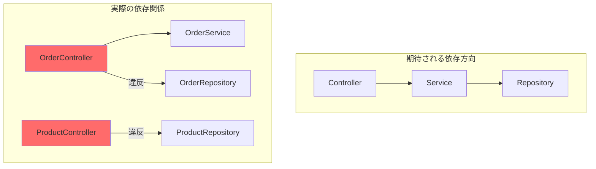

# MMI評価レポート - Legacy E-Commerce System

## 総合スコア

| 指標 | スコア | グレード |
|------|--------|---------|
| **総合MMI** | **45** | **D（要改善）** |

## 4軸評価

| 軸 | スコア | 重み | 加重スコア |
|----|--------|------|-----------|
| 設計整合性 | 53 | 30% | 15.9 |
| テストカバレッジ | 35 | 25% | 8.75 |
| ドキュメント | 25 | 20% | 5.0 |
| コード品質 | 62 | 25% | 15.5 |
| **合計** | - | **100%** | **45.15** |

## 4軸レーダーチャート

## グレード判定基準

| グレード | スコア範囲 | 説明 | 本システム |
|---------|-----------|------|-----------|
| A | 80-100 | 優秀 | |
| B | 65-79 | 良好 | |
| C | 50-64 | 普通 | |
| **D** | **35-49** | **要改善** | **該当** |
| E | 0-34 | 危険 | |

## 課題サマリー

| 重要度 | 件数 |
|--------|------|
| Critical | 8件 |
| Major | 10件 |
| Minor | 10件 |

---

## 軸別詳細評価

### 1. 設計整合性 (スコア: 53/100)

#### 1.1 単一責任の原則（SRP） — スコア: 60

**God Class（-15点/件 × 2件 = -30点）:**

| クラス | 行数 | 問題 |
|--------|------|------|
| `OrderService.java` | 192行 | 注文作成、決済処理、ステータス管理、バリデーションの4つの責務が混在 |
| `OrderController.java` | 134行 | DTO定義（内部クラス）、リポジトリ直接アクセス、ビジネスロジック混入 |

**Long Method（-5点/件 × 2件 = -10点）:**

| メソッド | 行数 | 問題 |
|----------|------|------|
| `OrderService.createOrder()` | ~60行 | 顧客検証、商品検索、在庫確認、金額計算、注文作成を1メソッドで実行 |
| `OrderController` 内の複数メソッド | - | リポジトリ操作とビジネスロジックが混在 |

#### 1.2 依存関係 — スコア: 60

**循環依存（-20点/件 × 1件 = -20点）:**

- `OrderService` → `InventoryService`: 直接呼び出し
- 両サービスが `ProductRepository` を共有し、在庫状態を通じて間接的に結合

**レイヤー違反（-10点/件 × 2件 = -20点）:**

| 違反箇所 | 内容 |
|----------|------|
| `OrderController` → `OrderRepository` | コントローラがサービス層を迂回してリポジトリ直接注入 |
| `ProductController` → `ProductRepository` | サービス層なし、コントローラがリポジトリ直接操作 |

#### 1.3 凝集度 — スコア: 40

- **パッケージ構造**: 技術的レイヤリングのみ（controller/service/model/repository/util）
- **ドメイン分離なし**: 注文・在庫・顧客・決済が同一パッケージに混在
- **OrderService**: 4つの異なるドメイン操作（注文、在庫、決済、顧客検証）を含む
- **Anemic Domain Model**: モデルにビジネスロジックなし、すべてサービス層に集中

---

### 2. テストカバレッジ (スコア: 35/100)

#### 2.1 単体テスト — スコア: 40

| 指標 | 値 |
|------|-----|
| テストファイル数 | 1 / 21 (4.8%) |
| テストメソッド数 | 1 |
| テスト対象クラス | OrderService のみ |
| 推定行カバレッジ | ~5% |
| 推定分岐カバレッジ | ~3% |

**テストされていないクラス:**
- `CustomerService` — テストなし
- `InventoryService` — テストなし
- `PaymentService` — テストなし
- `OrderController` — テストなし
- `CustomerController` — テストなし
- `ProductController` — テストなし
- 全モデルクラス — テストなし

#### 2.2 テストの質 — スコア: 30

| 指標 | 評価 |
|------|------|
| テストパターン | Happy path のみ |
| エッジケース | なし |
| 統合テスト | なし |
| E2Eテスト | なし |
| Mockito使用 | あり（適切） |
| アサーション | 基本的（assertNotNull, assertEquals, verify） |

**不足しているテストケース（OrderServiceTest コメントより）:**
- Customer not found
- Product not found
- Insufficient stock
- Invalid quantities
- Concurrent order creation
- Transaction rollback scenarios

---

### 3. ドキュメント (スコア: 25/100)

#### 3.1 API仕様 — スコア: 10

| 指標 | 状態 |
|------|------|
| OpenAPI/Swagger | なし |
| エンドポイント文書化率 | 0% |
| リクエスト/レスポンス仕様 | なし |
| エラーコード一覧 | なし |

#### 3.2 コードコメント — スコア: 20

| 指標 | 状態 |
|------|------|
| Javadoc カバレッジ | 0%（公開メソッド） |
| コメント種類 | 問題指摘コメントのみ（"Problem: ..."） |
| ビジネスロジック説明 | なし |
| パッケージ説明 | なし |

#### 3.3 設計ドキュメント — スコア: 45

| 指標 | 状態 |
|------|------|
| README.md | あり（255行、充実） |
| アーキテクチャ図 | なし |
| ドメインモデル図 | なし |
| 既知の問題一覧 | README内に記載あり |
| セットアップ手順 | README内に記載あり |

---

### 4. コード品質 (スコア: 62/100)

#### 4.1 循環複雑度 — スコア: 75

| 指標 | 値 |
|------|-----|
| 高複雑度メソッド | `OrderService.createOrder()`（推定 CC > 10） |
| 平均複雑度 | 推定 5-8（ほとんどが単純CRUD） |

#### 4.2 重複コード — スコア: 50

| 重複パターン | 箇所 |
|-------------|------|
| 顧客情報重複 | `Order` 内に `customerName`, `customerEmail`, `shippingAddress` を直接保持 |
| ログ出力パターン | `System.out.println` が全サービスに散在 |
| バリデーションパターン | `ValidationUtil` と各サービス内で個別にチェック |
| ステータス文字列 | `"PENDING"`, `"CONFIRMED"` 等がハードコード |

#### 4.3 命名規則 — スコア: 60

| 指標 | 評価 |
|------|------|
| Java命名規則準拠 | 概ね準拠 |
| マジックストリング | あり（ステータス値が文字列リテラル） |
| マジックナンバー | あり（`Thread.sleep(3000)` 等） |
| 内部クラスDTO | `OrderItemRequest`, `PaymentRequest` が内部クラス |
| 列挙型不使用 | ステータス値がStringのまま |

---

## 課題一覧

### Critical（8件）

| # | カテゴリ | 課題 | 該当箇所 |
|---|---------|------|----------|
| C-1 | セキュリティ | カード番号を平文で保存 | `Payment.cardNumber` |
| C-2 | セキュリティ | カード番号をコンソールログに出力 | `PaymentService` |
| C-3 | セキュリティ | 認証・認可機構なし | 全コントローラ |
| C-4 | セキュリティ | 入力バリデーションなし | 全エンドポイント |
| C-5 | 設計 | レイヤー違反（Controller→Repository直接アクセス） | `OrderController`, `ProductController` |
| C-6 | 設計 | 循環依存 | `OrderService` ⇄ `InventoryService` |
| C-7 | データ整合性 | 楽観ロックなし（race condition） | `InventoryService.reserveStock()` |
| C-8 | テスト | テストカバレッジ極端に不足（~5%） | プロジェクト全体 |

### Major（10件）

| # | カテゴリ | 課題 | 該当箇所 |
|---|---------|------|----------|
| M-1 | 設計 | God Class（複数責務混在） | `OrderService` |
| M-2 | 設計 | Anemic Domain Model | 全モデルクラス |
| M-3 | 設計 | 値オブジェクトの不在 | `Money`, `OrderStatus`, `Email` 等 |
| M-4 | 設計 | 集約境界の不在 | `OrderItem` が独立操作可能 |
| M-5 | 設計 | 不要なリポジトリ | `OrderItemRepository`（集約内エンティティ） |
| M-6 | 品質 | マジックストリング使用 | ステータス値全般 |
| M-7 | 品質 | 顧客情報の重複保持 | `Order` 内の顧客フィールド |
| M-8 | 品質 | `Thread.sleep` によるブロッキング | `PaymentService` |
| M-9 | ドキュメント | OpenAPI/Swagger仕様なし | プロジェクト全体 |
| M-10 | ドキュメント | Javadocなし | 全公開メソッド |

### Minor（10件）

| # | カテゴリ | 課題 | 該当箇所 |
|---|---------|------|----------|
| m-1 | 品質 | 不要なユーティリティクラス | `DateUtil`（Java 8+ APIで代替可能） |
| m-2 | 品質 | 不完全なバリデーション | `ValidationUtil`（Bean Validation使用すべき） |
| m-3 | 品質 | `System.out.println` によるログ出力 | 全サービスクラス |
| m-4 | 設計 | 列挙型不使用 | ステータス値 |
| m-5 | 設計 | 内部クラスによるDTO定義 | `OrderService`, `OrderController` |
| m-6 | 品質 | メール重複チェックなし | `CustomerService` |
| m-7 | 設計 | 住所が単純な文字列 | `Customer.address` |
| m-8 | 設計 | 価格に Money 値オブジェクトなし | `Product.price` |
| m-9 | テスト | テストが happy path のみ | `OrderServiceTest` |
| m-10 | 品質 | エラーハンドリングの不統一 | `RuntimeException` の多用 |
