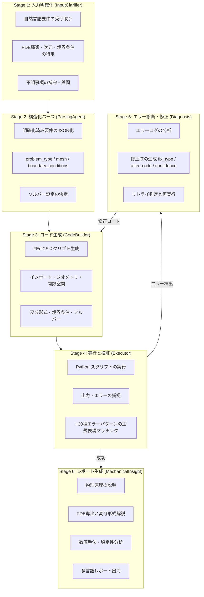
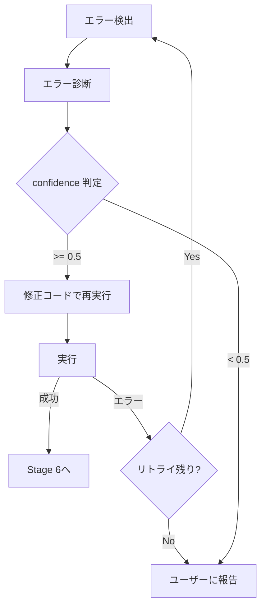

# Physics Simulation Skill (MCP-SIM ベース)

## 目的

自然言語で記述された物理シミュレーション要件を、検証済みのFEniCSシミュレーションコードに変換し、実行結果と教育向けレポートを生成するワークフローです。
MCP-SIM（Memory-Coordinated Physics-Aware Simulation）の「plan–act–reflect–revise」サイクルを再現し、曖昧や不完全な入力にも対応します。

## 参照リソース

| リソース | URL | 用途 |
|---------|-----|------|
| MCP-SIM リポジトリ | https://github.com/KAIST-M4/MCP-SIM | 元のフレームワーク |
| InputClarifierAgent | KAIST-M4/MCP-SIM/input_clarifier_agent.py | 入力明確化エージェント |
| ParsingAgent | KAIST-M4/MCP-SIM/parsing_agent.py | JSON構造化エージェント |
| CodeBuilderAgent | KAIST-M4/MCP-SIM/code_builder_agent.py | FEniCSコード生成エージェント |
| SimulationExecutorAgent | KAIST-M4/MCP-SIM/simulation_executor_agent.py | 実行・エラー検出エージェント |
| ErrorDiagnosisAgent | KAIST-M4/MCP-SIM/error_diagnosis_agent.py | エラー診断・修正エージェント |
| MechanicalInsightAgent | KAIST-M4/MCP-SIM/mechanical_insight_agent.py | 教育レポート生成エージェント |

## 入力パラメータ

| パラメータ | 必須 | 説明 | デフォルト |
|-----------|------|------|-----------|
| simulationRequest | Yes | 自然言語の物理シミュレーション要件 | - |
| physicsDomain | No | 物理領域の指定 | 自動推定 |
| dimension | No | 空間次元 (1D / 2D / 3D) | 自動推定 |
| solver | No | 線形ソルバー (MUMPS / PETSc / default) | MUMPS |
| timeIntegration | No | 時間積分手法 (backward_euler / newmark / steady) | backward_euler |
| reportLanguage | No | レポート言語 | ja |
| maxRetries | No | エラー修正の最大リトライ回数 | 3 |
| outputDir | No | 出力ディレクトリ | work/{projectName}/simulation/ |
| projectName | No | プロジェクト識別名 | physics-sim |

## 対応物理領域

| 領域 | キーワード | 典型的PDE |
|------|-----------|-----------|
| 線形弾性 | elasticity, stress, strain, deformation | ラメ・ナビエ方程式 |
| 熱伝導 | heat, temperature, conduction, diffusion | 拡散方程式 |
| 流体流動 | fluid, flow, velocity, pressure, Navier-Stokes | ナビエ-ストークス方程式 |
| 熱機械結合 | thermo-mechanical, thermal stress | 拡散＋弾性連立 |
| 圧電変形 | piezoelectric, actuator, electric field | 圧電方程式 |
| 相場破壊力学 | fracture, crack, phase-field | 相場モデル |
| ポアソン方程式 | Poisson, Laplace, electrostatics | ∇²u = f |
| 波動 | wave, vibration, acoustic | 波動方程式 |

---

## 実行フロー概要



---

## 実行フロー詳細

### Stage 0: 初期化と状態管理

```
0.1 出力ディレクトリの準備
    - work/{projectName}/simulation/ の作成
    - _state.md の初期化（または既存状態の読み込み）
    - 再開判定: 前回中断があれば途中から再開

0.2 状態ファイルの作成
    → work/{projectName}/simulation/_state.md
```

**状態ファイル例**:
```markdown
# 処理状態: physics-simulation

## メタ情報

| 項目 | 値 |
|------|-----|
| プロジェクト | {projectName} |
| スキル | physics-simulation |
| 開始時刻 | {timestamp} |
| 最終更新 | {timestamp} |
| 状態 | in_progress |
| 現在のステージ | Stage 0 |
| リトライ回数 | 0 |

## パラメータ

| パラメータ | 値 |
|-----------|-----|
| physicsDomain | (自動推定結果) |
| dimension | (自動推定結果) |
| solver | MUMPS |
| timeIntegration | backward_euler |
| reportLanguage | ja |
| maxRetries | 3 |
```

---

### Stage 1: 入力明確化 (InputClarifierAgent 対応)

MCP-SIMのInputClarifierAgentのRole: **曖昧な入力を技術的に精密なシミュレーション仕様に変換する。**

```
1.1 入力の受け取りと初期分析
    - simulationRequest を確認
    - 明確に記述されている要素と不明要素を分類
    - physicsDomain が指定されていれば優先、なければキーワード推定

1.2 四つの次元で完全性を確認
    a) 問題分類: PDE種類・次元・ドメイン幾何
    b) 物理パラメータ: 場変数・境界条件・材料特性
    c) 数値アプローチ: 時間ステッピング・ソルバー戦略・出力形式
    d) 出力要件: 可視化・レポート・データ形式

1.3 不明事項がある場合は質問
    - 「シミュレーションの境界条件は何ですか?」
    - 「材料の熱伝導率の値はいくつですか?」
    - 「時間依存の問題ですか、定常問題ですか?」
    → ユーザーの回答を受けて仕様を完全化

1.4 明確化済み仕様の作成
    - 単一段落の完全な技術的説明文を生成
    - Markdown見出しやリストなしの技術的散文
    → work/{projectName}/simulation/clarified_spec.md に書き出し
```

**エラー対応**: 明確化に失敗した場合は元の入力をそのまま次のステージに渡す（ワークフロー継続優先）。

---

### Stage 2: 構造化パース (ParsingAgent 対応)

MCP-SIMのParsingAgentの Role: **明確化済み仕様をFEniCSコード生成用のJSONに変換する。**

```
2.1 JSONスキーマの構築
    明確化済み仕様から以下のフィールドを抽出・构成:

    {
      "problem_type": "heat_conduction" | "elasticity" | "fluid_flow" | ...,
      "dimension": 1 | 2 | 3,
      "geometry": {
        "shape": "rectangle" | "circle" | "unit_square" | ...,
        "parameters": { "length": ..., "width": ..., ... }
      },
      "mesh": {
        "type": "structured" | "unstructured",
        "resolution": <整数>,
        "format": "xml" | "built-in"
      },
      "function_space": {
        "element": "Lagrange" | "Taylor-Hood" | ...,
        "degree": <整数>
      },
      "boundary_conditions": [
        { "type": "Dirichlet" | "Neumann" | "Robin", "location": "...", "value": "..." }
      ],
      "material_properties": {
        "density": ..., "thermal_conductivity": ..., ...
      },
      "time_stepping": {
        "method": "backward_euler" | "newmark" | null,
        "dt": <時間ステップ>,
        "T_final": <最終時刻>
      },
      "solver": {
        "linear_solver": "MUMPS" | "PETSc",
        "nonlinear_solver": "Newton" | "SNES"
      },
      "output": {
        "format": "pvd" | "xdmf" | "csv",
        "visualization": true | false
      },
      "original_text": "<明確化済み仕様の原文>"
    }

2.2 パース結果の保存
    → work/{projectName}/simulation/parsed_params.json (机械読み取り用)
    → work/{projectName}/simulation/parsed_params.txt (人間読み取り用)

2.3 パース失敗時のフォールバック
    - 抽出できなかったフィールドは null で埋め
    - original_text を保持
    - CodeBuilder で最善努力でコード生成を継続
```

---

### Stage 3: FEniCSコード生成 (CodeBuilderAgent 対応)

MCP-SIMのCodeBuilderAgentの Role: **パース済みパラメータからFEniCSシミュレーションコードを生成する。**

```
3.1 コード生成の指針
    MCP-SIMが強調するベストプラクティス:
    - 時間依存の熱問題には Backward Euler を使用
    - 線形ソルバーとして MUMPS を優先
    - 数値安定性のために分母に epsilon を追加
    - XMLメッシュの読み込みと境界マーカーのサポート
    - 問題タイプ: fluid_dynamics, heat_transfer, elasticity,
      hyperelasticity, phase_field_fracture

3.2 生成するコードの構造
    必須要素:
    a) インポート宣言 (fenics, numpy, etc.)
    b) メッシュと幾何の定義
    c) 関数空間の宣言
    d) 材料パラメータの設定
    e) 変分形式 (weak form) の定義
    f) 境界条件の適用
    g) ソルバーの設定と実行
    h) 結果の保存と (オプション) 可視化

3.3 生成結果の保存
    → work/{projectName}/simulation/generated_simulation.py

3.4 コード設定確認
    - 生成されたコードをユーザーに提示
    - 変更希望がある場合はフィードバックを受け付け再生成
```

**生成コードの例テンプレート**:
```python
from fenics import *
import numpy as np

# --- メッシュと幾何 ---
mesh = UnitSquareMesh(32, 32)

# --- 関数空間 ---
V = FunctionSpace(mesh, "Lagrange", 1)

# --- 材料パラメータ ---
k = Constant(1.0)  # 熱伝導率

# --- 変分形式 ---
u = TrialFunction(V)
v = TestFunction(V)
f = Constant(1.0)  # ソース項

a = inner(k * grad(u), grad(v)) * dx
L = f * v * dx

# --- 境界条件 ---
bc = DirichletBC(V, 0.0, "on_boundary")

# --- ソルバー ---
u_sol = Function(V)
solve(a, u_sol, L, bc, solver_method="mumps")

# --- 結果保存 ---
File("output/temperature.pvd") << u_sol
```

---

### Stage 4: シミュレーション実行と検証 (SimulationExecutorAgent 対応)

MCP-SIMのSimulationExecutorAgentの Role: **生成されたPythonスクリプトを実行し、出力とエラーを捕捉する。**

```
4.1 実行前の確認
    - 生成されたコードの構文チェック (python -m py_compile)
    - FEniCSの依存関係の確認
    - 実行環境のパス設定

4.2 スクリプトの実行
    - subprocess による実行
    - stdout と stderr の両方を捕捉
    - タイムアウト設定 (デフォルト: 10分)

4.3 エラーパターンの検出 (~30種)
    正規表現マッチングで検出する典型エラー:

    | カテゴリ | エラー例 |
    |---------|---------|
    | Python基本 | NameError, TypeError, ValueError, ImportError |
    | FEniCS固有 | UFLException, DiofitsoError, MeshError |
    | 数値収束 | "did not converge", "Maximum iterations exceeded" |
    | メモリ | MemoryError, "out of memory" |
    | 境界条件 | "boundary not found", "incompatible dimensions" |
    | ソルバー | "singular matrix", "zero pivot", "LU factorization failed" |

4.4 実行結果の判定
    - 成功: stdout を返却 → Stage 6へ
    - エラー検出: stdout + stderr を結合 → Stage 5へ
    → work/{projectName}/simulation/execution_log.txt に書き出し
```

---

### Stage 5: エラー診断と修正 (ErrorDiagnosisAgent 対応)

MCP-SIMのErrorDiagnosisAgentの Role: **エラーメッセージ・コード・実行結果を分析し、修正案を生成する。**

```
5.1 エラー情報の収集
    - エラーメッセージ
    - 元のソースコード
    - シミュレーション実行結果（stdout/stderr）
    - パース済みパラメータ (JSON)

5.2 診断と修正案の生成
    返却フォーマット (JSON):
    {
      "fix_type": "parsing" | "code",
      "hint": "エラーの説明と対策の説明文",
      "after_code": "修正後の完全なPythonコード",
      "confidence": 0.0 ~ 1.0  // 修正の信頼度
    }

5.3 リトライ判定
    - confidence >= 0.5: 修正コードで再実行 (Stage 3 → 4へ)
    - confidence < 0.5: ユーザーに提示し判断を求める
    - リトライ回数が maxRetries を超えた場合: 停止し結果を報告

5.4 エラーログの保存
    - タイムスタンプ付きのエラー詳細
    - ソースコード
    - シミュレーション結果
    → work/{projectName}/simulation/error_log.json に書き出し
    → work/{projectName}/simulation/last_prompt.txt (診断プロンプト保存)
```

**リトライサイクルの図**:


---

### Stage 6: 教育レポート生成 (MechanicalInsightAgent 対応)

MCP-SIMのMechanicalInsightAgentの Role: **シミュレーションコードを分析し、学習者向けの説明レポートを生成する。**

```
6.1 レポートの構成 (8セクション)
    1. シミュレーション目的の説明
    2. 物理原理の解説
    3. PDE (偏微分方程式) の導出
    4. コードの段階的解説
    5. 重要因子の特定
    6. 数値的考慮事項 (稳定性・収束)
    7. まとめと結論
    8. 推奨事項と次のステップ

6.2 言語設定
    - reportLanguage パラメータに基づき生成
    - デフォルト: 日本語 (ja)
    - 支援: ja, en, ko, zh, fr, de, es

6.3 レポート保存
    → work/{projectName}/simulation/simulation_report.md
    → reports/{projectName}/physics-simulation-report.md (最終成果物)
```

---

## 出力成果物

### 最終成果物

```
reports/{projectName}/
└── physics-simulation-report.md      # 教育向けレポート

work/{projectName}/simulation/
├── _state.md                          # 全体進捗状態
├── clarified_spec.md                  # Stage 1: 明確化済み仕様
├── parsed_params.json                 # Stage 2: 構造化パラメータ (JSON)
├── parsed_params.txt                  # Stage 2: 構造化パラメータ (人間向け)
├── generated_simulation.py            # Stage 3: FEniCSコード
├── execution_log.txt                  # Stage 4: 実行ログ
├── error_log.json                     # Stage 5: エラーログ (あれば)
├── last_prompt.txt                    # Stage 5: 診断プロンプト (あれば)
└── simulation_report.md               # Stage 6: 教育レポート
```

---

## 使用例

### 例1: 基本的な熱伝導シミュレーション

```
Skill: physics-simulation

シミュレーション要件: 正方形ドメインの2D熱伝導問題。左端を100度、右端を0度に固定し、上下は断熱条件。定常状態を求める。
```

### 例2: 詳細パラメータ指定

```
Skill: physics-simulation

シミュレーション要件: 円筒形の線形弾性体に圧力荷重を適用し変形を計算する
物理領域: elasticity
次元: 3D
ソルバー: MUMPS
レポート言語: ja
プロジェクト名: cylinder-stress
```

### 例3: 流体シミュレーション

```
Skill: physics-simulation

シミュレーション要件: リД形チャネルの定常ラミナー流れ。入口で一様な速度を指定し、出口で自然境界条件を設定。レイノルズ数は100程度。
物理領域: fluid_flow
次元: 2D
最大リトライ: 5
```

### 例4: 中断からの再開

```
# 前回の状態を確認
cat work/cylinder-stress/simulation/_state.md

# 同じパラメータで再実行 (自動的に途中から再開)
Skill: physics-simulation

プロジェクト名: cylinder-stress
シミュレーション要件: 円筒形の線形弾性体に圧力荷重を適用し変形を計算する
```

---

## FEniCSの依存関係

このスキルは FEniCS (https://fenics.project.org/) を実行環境として必要とします。

### インスタッション方法

**Docker (推奨)**:
```bash
docker pull quay.io/fenics/dolfinx:latest
docker run -it -v $(pwd):/workspace quay.io/fenics/dolfinx:latest
```

**Conda**:
```bash
conda install -c conda-forge fenics
```

### 確認コマンド
```bash
python -c "import fenics; print(fenics.__version__)"
```

---

## 注意事項

1. **曖昧な入力への対応**
   - MCP-SIMの設計哲学に基づき、不完全な入力でも最善努力で処理を継続
   - 不明事項はユーザーに質問し補完する

2. **エラー修正の信頼度**
   - confidence スコアが低い場合はユーザーの確認を求める
   - 最大リトライ回数超過時は診断結果を報告し停止

3. **数値安定性**
   - 分母には epsilon を追加（ゼロ除算防止）
   - 時間依存問題には Backward Euler を優先
   - MUMPS ソルバーを線形ソルバーとして優先

4. **大規格問題の注意**
   - 3Dの高解像度メッシュは計算時間が長い
   - メモリ不足の場合はメッシュ解像度を下げる
   - 並列計算には MPI を使用

5. **中間状態管理**
   - work/ ディレクトリは `.gitignore` に追加推奨
   - 中断した場合、同じパラメータで再実行すると自動的に途中から再開
